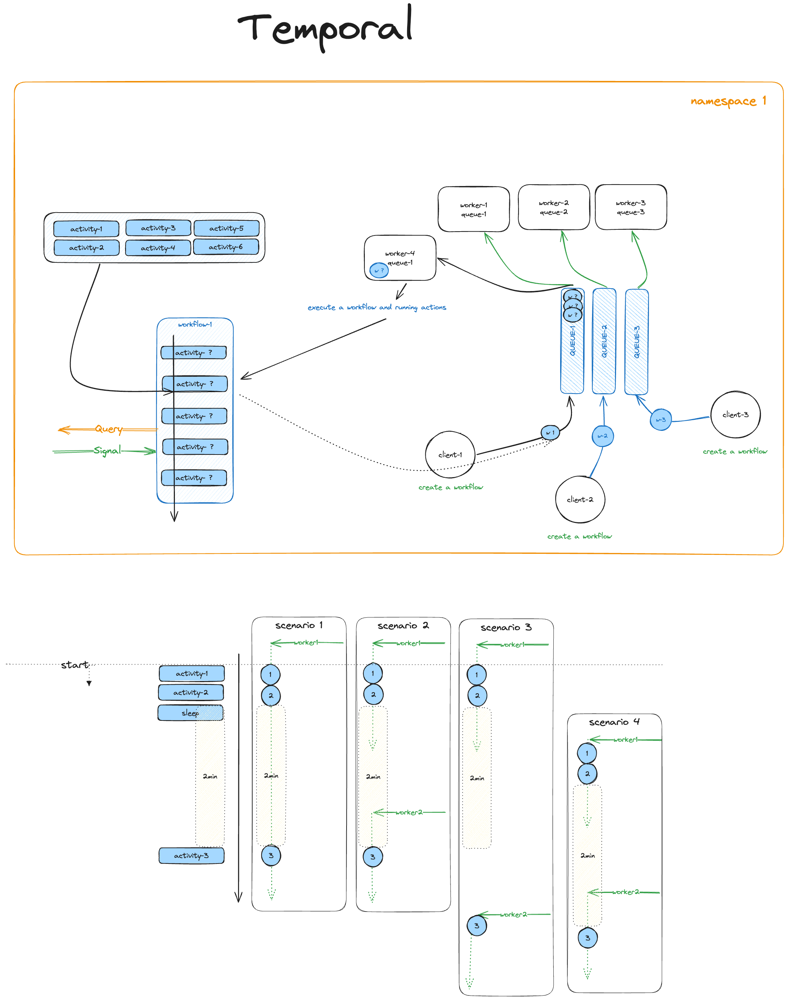

# Temporal Workflow Engine Projects

This repository contains several projects designed to work with Temporal. Each project serves a specific purpose in demonstrating or implementing Temporal workflows in various frameworks and configurations.

## Projects Overview

### 1. `hello-world`
A simple introduction to Temporal workflows. This project demonstrates a basic workflow and activity setup using Temporal's core features. It's designed to help you get familiar with the Temporal SDK and how workflows are structured.

### 2. `nestjs-temporal`
This project integrates Temporal with a NestJS application, allowing you to run workflows within the context of a NestJS service. It's a more advanced example that demonstrates how to use Temporal with a modern Node.js framework.

### 3. `nextjs-temporal-one-click-template`
This project provides a one-click template setup to run a Temporal workflow engine with a Next.js frontend. It's a quick way to get started with Temporal workflows in a Next.js environment, demonstrating seamless frontend-backend integration.

### 4. `subscription-workflow-project-template-typescript`
A more complex template designed for handling subscription-based business logic using Temporal workflows. This project showcases how you can model real-world scenarios like recurring billing, customer subscription lifecycles, and payment retries using Temporal.

### 5. `test-temporal`
A project focused on testing and validating Temporal workflows. It provides a set of example tests and methodologies to verify the correctness and reliability of your workflows. This project is useful for anyone looking to integrate testing best practices into their Temporal projects.

## Getting Started

This repository is designed to be easily set up in a local development environment using Docker Compose. The following sections will guide you through the setup and usage of the projects.

### Prerequisites

Make sure you have the following installed on your system:
- [Docker](https://www.docker.com/get-started)
- [Docker Compose](https://docs.docker.com/compose/install/)
- Node.js (for running the JavaScript/TypeScript projects)
- Yarn or npm (for package management)

### Setup

1. Clone the repository:
    ```bash
    git clone <your-repository-url>
    cd <repository-directory>
    ```

2. Set up the environment using Docker Compose:
    ```bash
    docker-compose up
    ```

    This will spin up all the required services for Temporal, including:
    - Temporal Server
    - Temporal Web UI
    - Postgres (or another database, if configured)

3. Navigate to individual projects and install dependencies:

    For example, to set up `hello-world`:
    ```bash
    cd hello-world
    npm install 
    ```

    Repeat this step for other projects like `nestjs-temporal`, `nextjs-temporal-one-click-template`, etc.

4. Run the projects:

    Each project has its own README for specific instructions. In general, you can run a project by navigating to the project directory and executing:
    ```bash
    npm start 
    ```

5. Access Temporal Web UI:

   After the Docker Compose services are up, you can access the Temporal Web UI at:
   ```
   http://localhost:8098/
   ```

Below is a visual representation of Temporal dependency graph:
